---
# try also 'default' to start simple
theme: dracula
# random image from a curated Unsplash collection by Anthony
# like them? see https://unsplash.com/collections/94734566/slidev
background: ./images/rf_village.png
# some information about your slides (markdown enabled)
title: Plataforma CTF Wardriving
# apply UnoCSS classes to the current slide
class: text-center
# https://sli.dev/features/drawing
drawings:
  persist: false
# slide transition: https://sli.dev/guide/animations.html#slide-transitions
transition: slide-left
# enable Comark Syntax: https://comark.dev/syntax/markdown
comark: true
# duration of the presentation
duration: 10min
---

# Manual de uso de plataforma CTF Wardriving 

<!--
The last comment block of each slide will be treated as slide notes. It will be visible and editable in Presenter Mode along with the slide. [Read more in the docs](https://sli.dev/guide/syntax.html#notes)
-->

---
transition: fade-out
---

# ¿Qué es el Wardriving?

- 🛜 **El wardriving** puede definirse como el escaneo pasivo de redes que emiten una radio frecuencia en el espacio
- 🌐 **Aspectos importantes** el wardriving no solo involucra el escaneo pasivo de redes, tambien se apoyo de uso de servicios de GPS para ubicar espacialmente la calidad de la señal de las redes escaneadas, de esta manera es posible encontrar una aproximación al dispositivo físico

---
transition: slide-up
level: 2
---

# Plataforma CTF

Para participar en esta plaforma hay dos aplicaciones que te facilitaran la participación
## Aplicaciones disponibles

|                                                     |                                 |               |
| --------------------------------------------------- | ------------------------------- | ------------- |
| <kbd>CTF</kbd>                           | https://www.wardriving.lat/ctf/ | Usala para ver tu progreso en el CTF y visualizar el mapa con tus avances |
| <kbd>Marauder</kbd>                      | https://marauder.wardriving.lat/marauder-ui-pro/ | Usala junto con tu badge o tu hardware que cuente con el firmware Marauder ESP32 y explora pero no pierdas de vista tu participación en el CTF |

---
layout: section
transition: slide-left
---

# Navegando la plataforma CTF

---
layout: two-cols
layoutClass: gap-16
---

# Plataforma CTF

En la plataforma del CTF tendras que ingresar con el usuario que te registraste

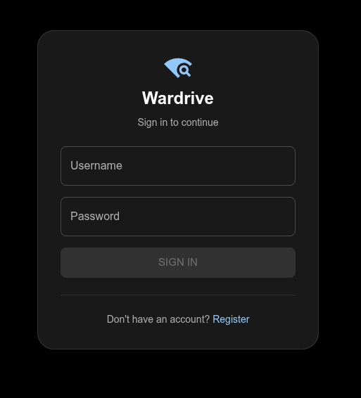

::right::

Sino te haz registrado hazlo para acceder a la plataforma y participar

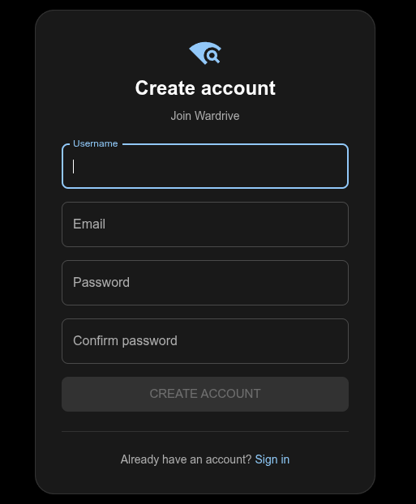

---
layout: default
---

  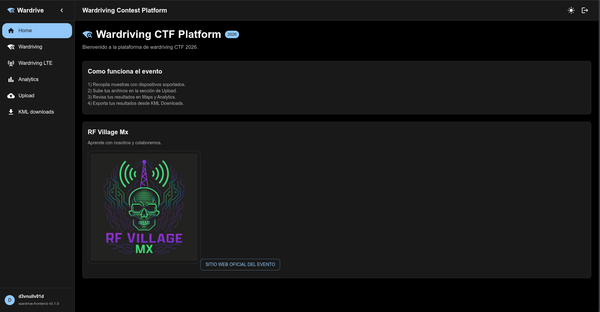

<h1>Navegando la plataforma</h1>

<ul>
  <li>Una vez ingresando la plataforma tendrás la siguiente UI</li>
  <li>
    Los botones laterales de la izquierda son accesos a distintas operaciones:
    <ul>
      <li>Wardriving</li>
      <li>Wardriving LTE</li>
      <li>Analytics</li>
      <li>Upload</li>
      <li>KML Download</li>
    </ul>
  </li>
</ul>

---
layout: default
transition: slide-left
---

  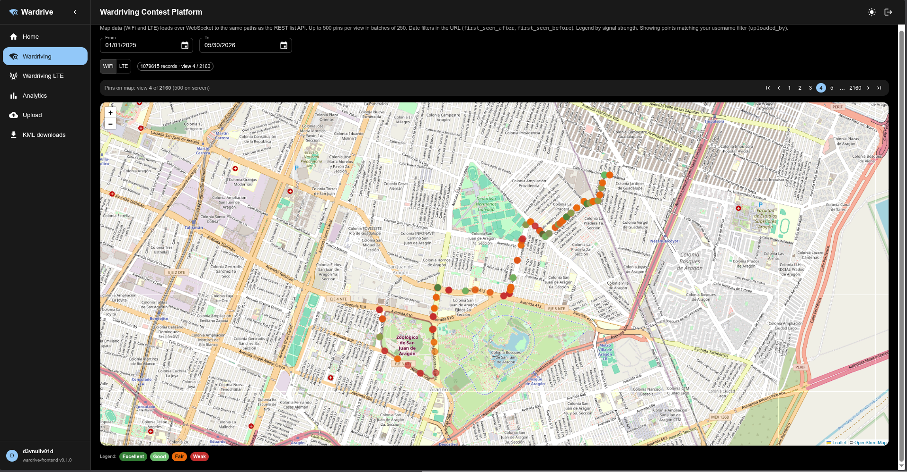

<h1>Wardriving — WiFi & BLE</h1>

<ul>
  <li>Visualiza el <strong>mapa georreferenciado</strong> con todos tus escaneos de redes WiFi y Bluetooth Low Energy (BLE)</li>
  <li>Cada punto en el mapa representa una red detectada junto con su ubicación GPS en el momento del escaneo</li>
  <li>Puedes identificar la densidad de señal y la distribución espacial de las redes en la zona explorada</li>
  <li>El mapa se actualiza conforme subes nuevos archivos de escaneo a la plataforma</li>
</ul>

---
layout: default
transition: fade-out
---

  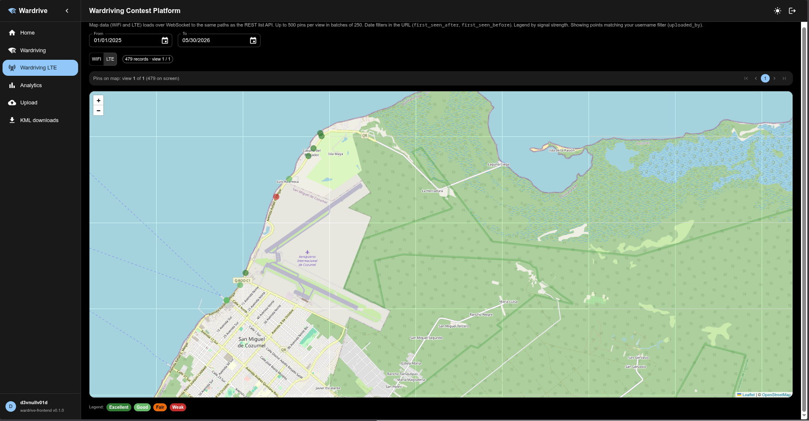

<h1>Wardriving LTE</h1>

<ul>
  <li>Visualiza el <strong>mapa de cobertura LTE</strong> con los escaneos de redes celulares georreferenciados</li>
  <li>Cada punto corresponde a una torre o celda LTE detectada durante el recorrido, con su ubicación GPS</li>
  <li>Permite analizar la distribución y cobertura de la infraestructura celular en el área explorada</li>
  <li>Los datos se actualizan al subir nuevos archivos de escaneo LTE a la plataforma</li>
</ul>

---
layout: two-cols
layoutClass: gap-8
transition: slide-left
---

# Analytics

## Tus estadísticas

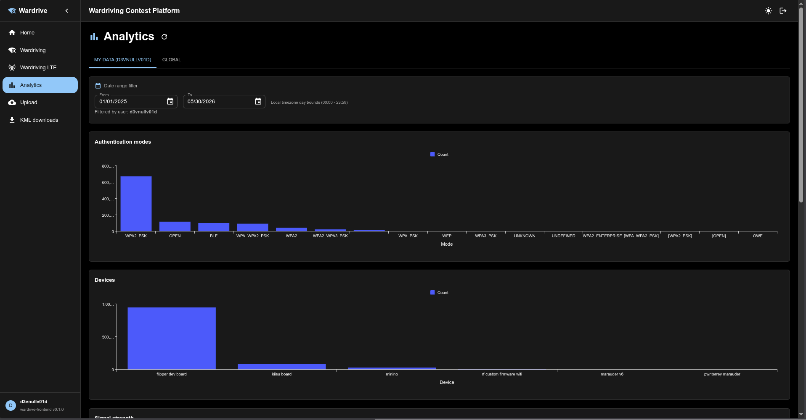

Consulta tu progreso personal: redes descubiertas, puntos acumulados y tu posición en el ranking del CTF.

::right::

## Marcador global

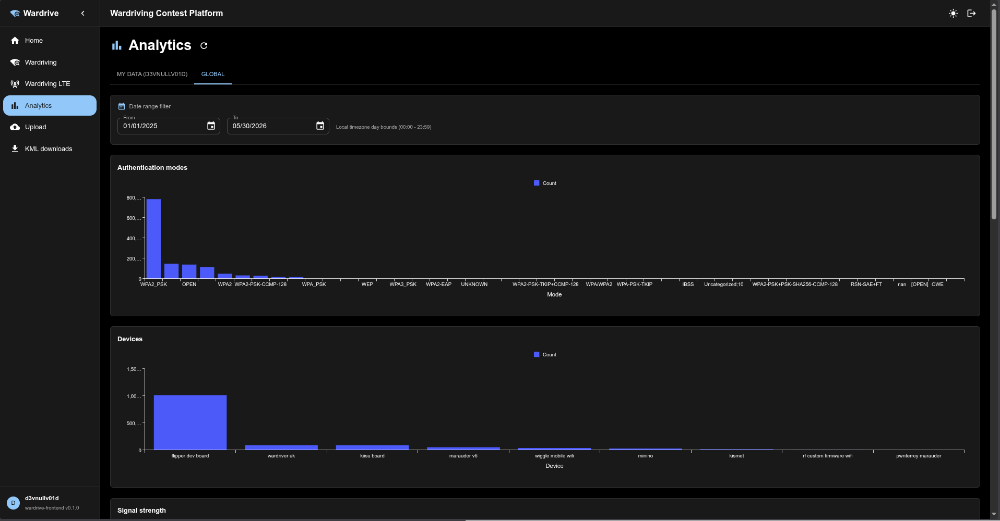

Vista del scoreboard general con todos los participantes, sus escaneos totales y posición en tiempo real.

---
layout: default
transition: slide-left
---

  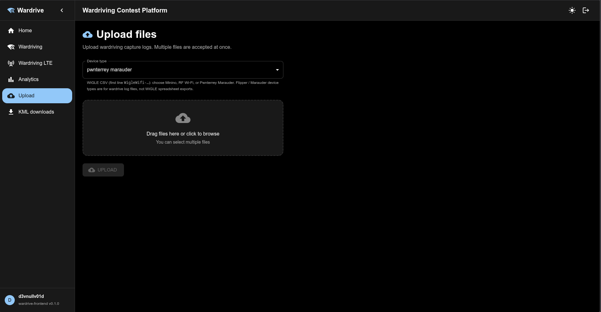

<h1>Upload</h1>

<ul>
  <li>Puedes subir hasta <strong>100 archivos de manera simultánea</strong></li>
  <li><strong>No repitas ni compartas archivos</strong> con otros participantes bajo ninguna circunstancia — cada archivo debe ser único y propio</li>
  <li>Debes <strong>seleccionar el hardware</strong> que utilizaste para realizar los escaneos antes de subir</li>
  <li>Si tienes un <strong>nuevo tipo de archivo</strong> que la plataforma no reconoce, por favor compártelo a la brevedad para brindar el soporte necesario</li>
</ul>

---
layout: default
transition: fade-out
---

# KML Download

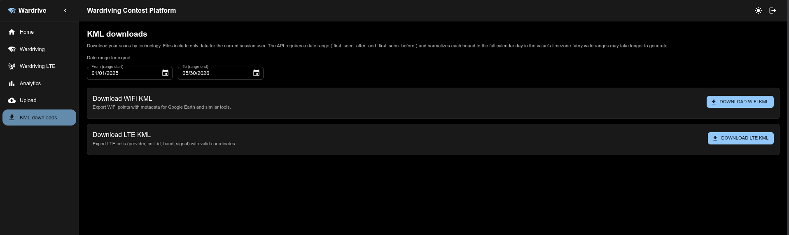

- Herramienta para **descargar tus escaneos** en formato KML, compatible con Google Earth y otras aplicaciones de mapas

- ⚠️ **Fase Beta** — esta funcionalidad aún está en desarrollo y puede presentar fallas o comportamientos inesperados

---
layout: section
transition: slide-left
---

# Navegando la plataforma Marauder

---
layout: two-cols
layoutClass: gap-8
transition: fade-out
---

# Plataforma Marauder

## Interfaz principal

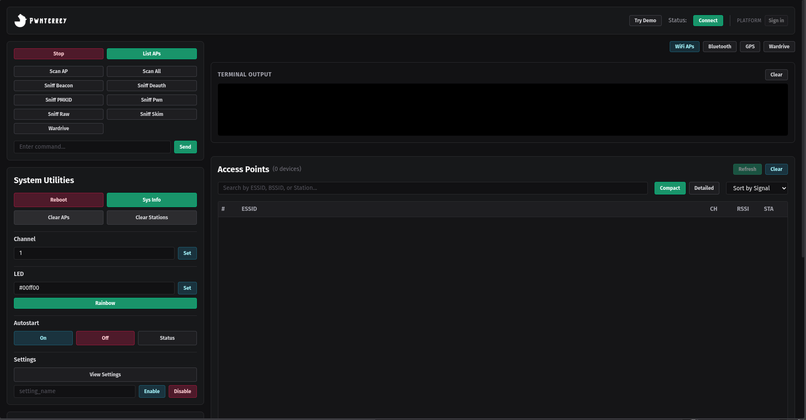

Conecta tu **badge** o **ESP32** con firmware Marauder para utilizar la plataforma de wardriving.

::right::

## Selección de hardware

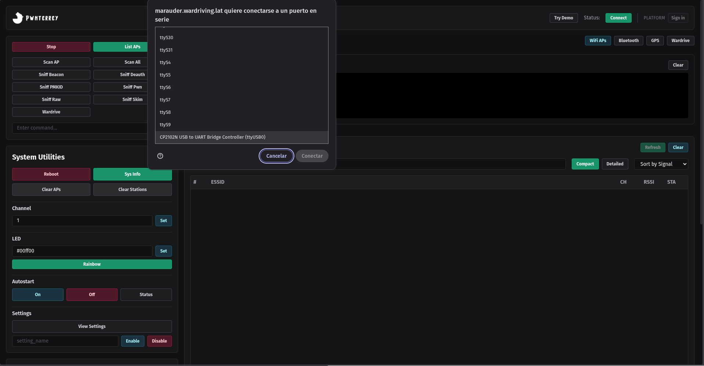

<v-click>

> ⚠️ **Requisito obligatorio:** el hardware **debe contar con GPS** para que los escaneos queden georreferenciados correctamente.

</v-click>

---
layout: default
transition: slide-left
---

  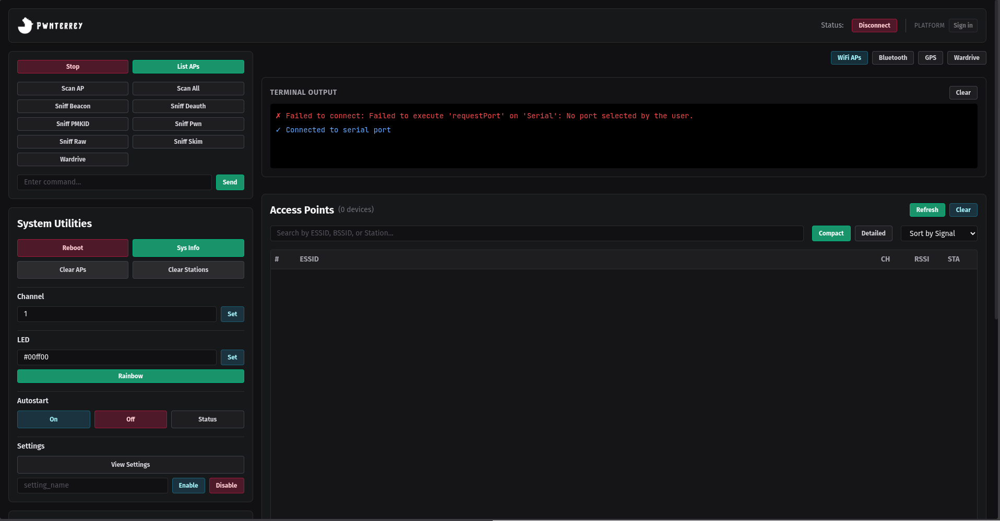

<h1>WebSerial & Comandos</h1>

Tu navegador debe soportar <strong>WebSerial API</strong> para comunicarse con el hardware. 
<em>Recomendado: Chrome, Edge o Brave.</em>

<h3>Comandos principales de Marauder ESP32</h3>

| Comando | Descripción |
|---------|-------------|
| `help` | Lista todos los comandos disponibles |
| `wardrive` | Inicia el modo wardriving con GPS |
| `stopscan` | Detiene el escaneo activo |
| `gpsdata` | Muestra datos GPS en tiempo real |

---
layout: two-cols
layoutClass: gap-16
transition: fade-out
---

# Plataforma Marauder

Para acceder, presiona el botón **Platform** en la interfaz de Marauder.

### Crear cuenta

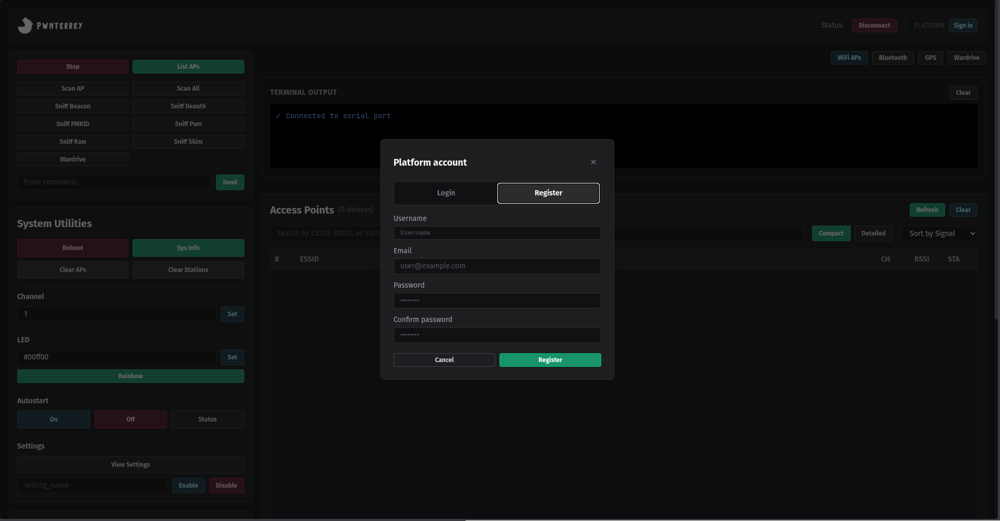

Regístrate con tu correo y contraseña para participar en el CTF.

::right::

### Iniciar sesión

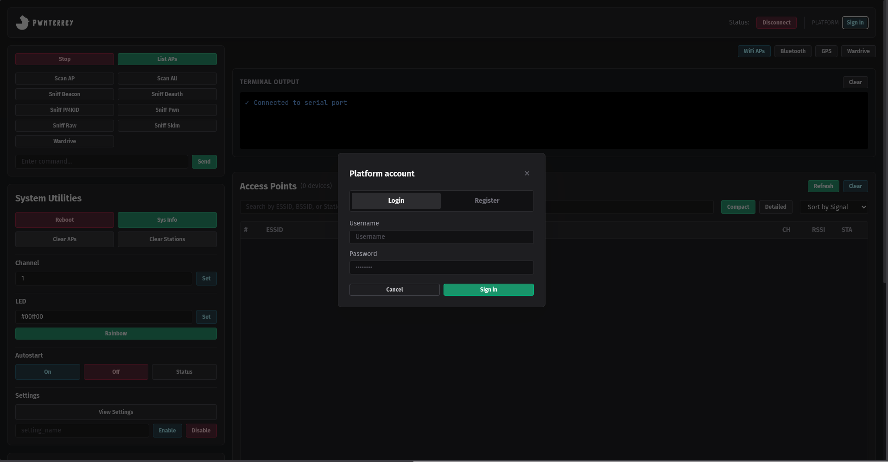

Ingresa con tus credenciales para acceder a tu panel y comenzar a subir escaneos.

---
layout: default
transition: slide-left
---

  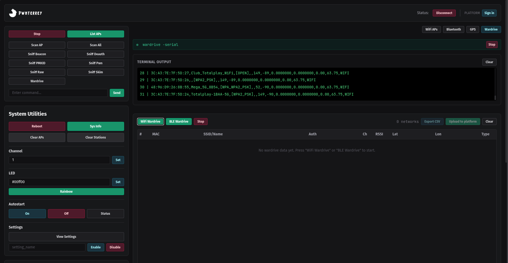

<h1>Modo Wardrive</h1>

<ol>
  <li>En el menú principal selecciona la opción <strong>Wardrive</strong></li>
  <li>Dentro del menú Wardrive, elige <strong>WiFi Wardrive</strong></li>
  <li>El dispositivo comenzará a escanear redes WiFi mientras registra la posición GPS en cada detección</li>
  <li>Mantén el dispositivo activo y en movimiento para ampliar la cobertura del mapa</li>
</ol>

---
layout: default
transition: fade-out
---

  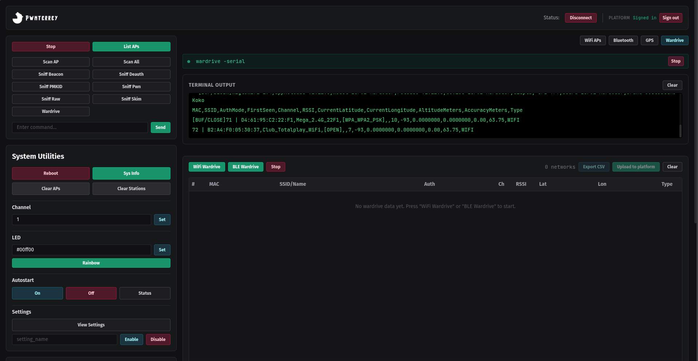

<h1>Guardar y subir escaneos</h1>

Durante el wardrive encontrarás dos botones importantes:

<ul>
  <li><kbd>Export CSV</kbd> — Almacena los escaneos <strong>localmente</strong> en el dispositivo para respaldo personal</li>
  <li><kbd>Upload to Platform</kbd> — Sube los datos <strong>directamente a la plataforma CTF</strong> para contabilizar tu progreso</li>
</ul>

 

<blockquote>
  ⚠️ <strong>Importante:</strong> mientras el GPS no esté listo y con señal, <strong>ningún registro aparecerá</strong> en la pantalla de la aplicación. Espera a tener fix GPS antes de iniciar el wardrive.
</blockquote>

---
layout: cover
background: ./images/rf_village.png
class: text-center
transition: fade
---

# ¡A divertirse!

Diviértanse realizando su **wardriving** antes y durante el evento.

  Exploren, escaneen y compartan sus hallazgos — nos vemos en el marcador global.

